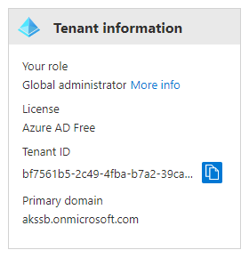

# Azure Kubernetes Service Secure Baseline Workshop

## Part 0: Pre-requisites

---

### Create a new Azure AD tenant

The AKS Secure Baseline creates some groups and identities in your Azure AD tenant. You may not have the necessary privileges to perform these steps, so it's often easier to create a new Azure AD tenant. This can be done easily through the Azure Portal.

In the portal, go to *Create a Resource* and search for "Azure Active Directory".


Click *Create*, then fill in the organisation name, domain name and country or region. The organisation name and domain name can be anything you like, but the domain name will need to be something that hasn't been used before.


When finished, click the link to manage your new tenant. Then when the overview page appears, make a note of your tenant ID.



---

### Tools

You will need an up to date installation of a git client, the Azure CLI and `kubectl`. 

If you have the Azure CLI installed, you can install `kubectl` with the following command.

```
az aks install-cli
```

Any environment which has these tools should be sufficient, including the Azure Cloud Shell.

---

### Github Repositories

You will need a local copy of the AKS Secure Baseline repository. You can find it here:

https://github.com/mspnp/aks-secure-baseline

