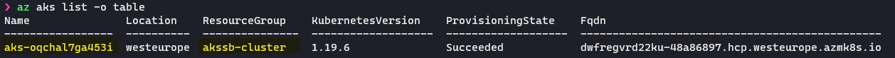
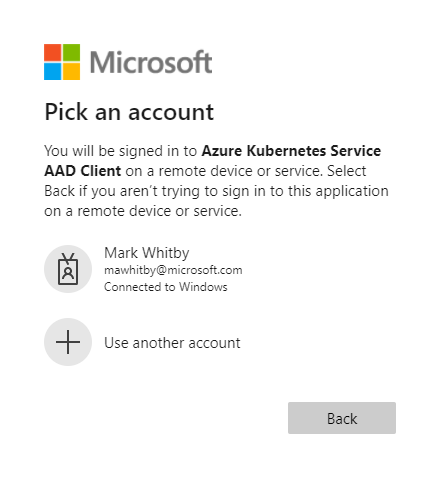

# Azure Kubernetes Service Secure Baseline Workshop

## Part 3: Authorisation and Authentication

In parts 1 and 2 of this workshop you will have completed the deployment of an AKS cluster and various supporting Azure services. In this and the remaining parts of the workshop, we will dive deeper into the various components to help you understand how they work and why they are used.

Your cluster has had Azure Active Directory integration enabled. The easiest way to see what this means, is to try and do something on your cluster.

First, let's find the details of your newly deployed cluster. Type the following command

``` az aks list -o table ```

You will see a list of AKS clusters. Find the cluster you just deployed and note its name and resource group name.



We will now get the access credentials needed for our cluster.

``` az aks get-credentials -n <your cluster name> -g <your cluster's resource group> ```

After a few seconds, you should see a message that tells you your cluster has been merged as current context

Merged "aks-oqchal7ga453i" as current context in /home/mark/.kube/config

contexts:
- context:
    cluster: aks-oqchal7ga453i
    user: clusterUser_akssb-cluster_aks-oqchal7ga453i
  name: aks-oqchal7ga453i
current-context: aks-oqchal7ga453i
kind: Config
preferences: {}
users:
- name: clusterUser_akssb-cluster_aks-oqchal7ga453i
  user:
    auth-provider:
      config:
        apiserver-id: 6dae42f8-4368-4678-94ff-3960e28e3630
        client-id: 80faf920-1908-4b52-b5ef-a8e7bedfc67a
        config-mode: '1'
        environment: AzurePublicCloud
        tenant-id: 72f988bf-86f1-41af-91ab-2d7cd011db47
      name: azure

Now let's see what happens when we try to run a command against our cluster. Try the following

``` kubectl get pods -A ```

This should list all of the pods running in your cluster across all namespaces. However, what you should see is a prompt similar to the following

> To sign in, use a web browser to open the page https://microsoft.com/devicelogin and enter the code AH8HHMZFX to authenticate.

This is because your cluster has AAD integration enabled and you need to authenticate using an AAD account. Go ahead and open [](https://microsoft.com/devicelogin) and enter the code. Remember your code will be different to the one documented here!  You'll then be asked to authenticate with Azure AD.

- Use the Azure AD account that you added to the AKS management group



- 

kubectl describe clusterrolebinding aks-cluster-admin-binding-aad