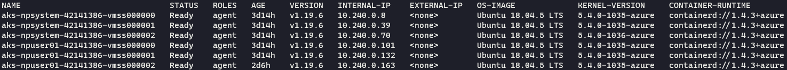
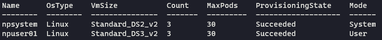

# Azure Kubernetes Service Secure Baseline Workshop

## Part 4: Cluster Compute

In this section, we'll examine the nodes that have been deployed in your AKS cluster.

```
kubectl get nodes -o wide
```



```
az aks nodepool list --cluster-name aks-oqchal7ga453i -g akssb-cluster -o table
```


