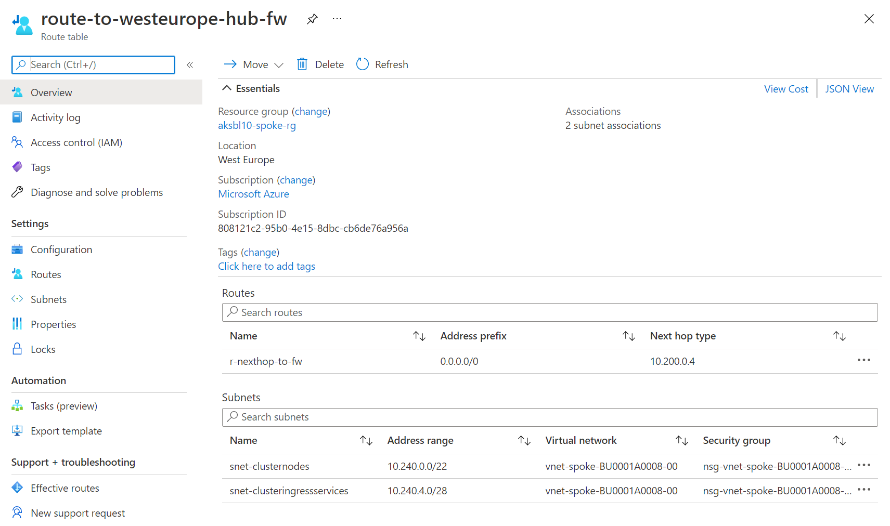

# Azure Kubernetes Service Secure Baseline Workshop

## Part 8: Azure Networking

In this section, we cover the Azure networking components deployed by the secure baseline implementation. In part 9, we will look at the Kubernetes specific networking components.

## Concepts

The networking model recommended by the secure baseline reference architecture should come as no surprise. It's the familiar hub and spoke architecture advocated by the Cloud Adoption Framework and Enterprise Scale Landing Zones. In this model, a hub network provides common services, such as firewalls, bastion hosts and access to on-premises services. Spoke networks are then deployed for specific services or business units, peered to the hub network in order to take advantage of the services it provides.

Within the hub network, there are three subnets defined. One is for Azure Firewall, one is for Azure Bastion and one is for an on-premises gateway. In the secure baseline implementation, all three hub subnets are created, but the only subnet with a live service deployed is the one for Azure Firewall.

In the spoke network, the AKS cluster is deployed along with it's load balancer and an Application Gateway. Three subnets are created, one for the AKS cluster nodes, one for Application Gateway and one for the Ingress controller. The spoke network also has a route table defined which is configured to route all egress traffic from the cluster node and ingress subnets via the Azure Firewall instance in the hub network.

Azure Firewall is configured to allow essential services such as DNS, software updates and time sync, communications between the AKS cluster nodes and the managed control plane, monitoring and policy. Azure Firewall is supplemented by Network Security Groups, which are applied across the hub and spoke subnets to further control traffic entering and leaving the network.

Private Link is enabled on Azure Container Registry and Azure Key Vault. Private endpoints are configured on the cluster node subnet to allow the AKS cluster nodes to access these services. Access from outside of these networks is blocked.

---

## Exercises

Using the Azure Portal, find the route table for your spoke network and confirm that it is fowarding all traffic to the Azure Firewall.

Using the Azure Portal, find the Azure Firewall rules. Identify the rules that allow the AKS cluster to operate normally, including rules that allow the following:

- Software package installations and updates
- Access to Azure Container Registry
- Access from pods / nodes to the cluster API server

Inspect the private link configuration in the Azure Portal. Find the endpoints that allow the AKS cluster nodes access to the Azure Container Registry and Azure Key Vault.

In Azure Container Registry and Azure Key Vault, confirm that access via public networks is not allowed.

---

## Summary

The secure baseline is built on the hub and spoke architecture that is a typical feature of many Azure deployments and provides secure a secure path for egress traffic from an AKS cluster. It also limits and secures communications between AKS and other Azure services.
