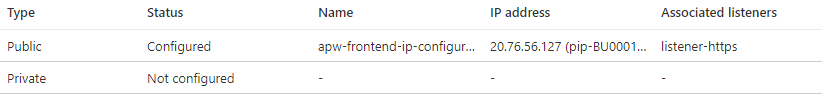
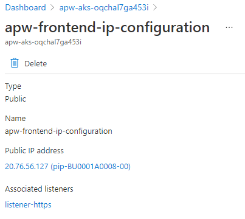
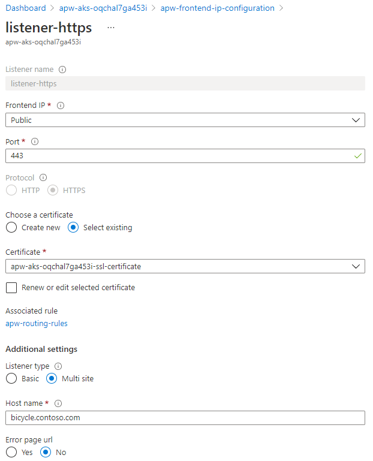
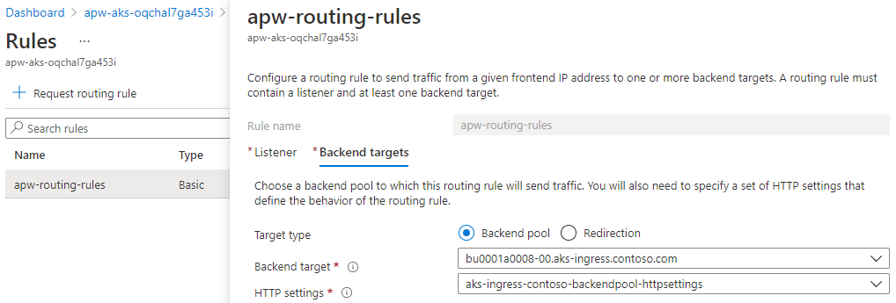
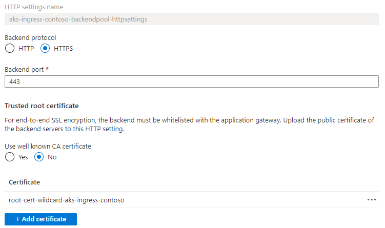

# Azure Kubernetes Service Secure Baseline Workshop

## Part 9: Kubernetes Networking

In this section, we cover the Kubernetes specific networking components.

## Concepts

One of the first decisions that needs to be made when considering Kubernetes networking, is which networking model to use - kubenet or Azure CNI. There are a number of factors to consider when making this decision, but for the secure baseline we want to implement Azure Network Policy and this requires Azure CNI.

Azure Network Policy is a feature that allows you to control the traffic flow between pods, effectively a firewall running inside the Kubernetes cluster. You can choose to allow or deny traffic based on settings such as assigned labels, namespaces or ports. This makes it possible to configure applications running in the cluster to only communicate with the specific endpoints that they need to.

Ingress, the traffic coming into our cluster, is being routed through an Azure Application Gateway with Web Application Firewall (WAF) enabled. The Application Gateway has a public IP address to accept external HTTPS traffic. It acts as a TLS termination point, so it will decrypt the traffic and then process the WAF rules to look for potential issues. If there are no problems, the traffic is then encrypted again and forwarded to the Ingress controller running in the AKS cluster.

You can choose from a number of products to implement Ingress in Kubernetes. Traefik (simply pronounced "traffic") has been selected for the secure baseline implementation simply to show how third party products can be integrated with Azure services. In this case, we're using Pod Identity to allow Traefik to use a Managed Identity to access Azure Key Vault.

Application Gateway and Traefik both require access to certificates. A TLS certificate is used by Application Gateway to terminate incoming traffic and then a second certificate is used to re-encrypt traffic before it is sent on to the Ingress controller. The certificates are securely stored in Azure Key Vault and private link is used to restrict network access to Key Vault.

Traefik uses one of those certificates to terminate traffic incoming from Application Gateway. To access the secret in Azure Key Vault, it uses an open source add-on called the Azure Key Vault provider for Secrets Store CSI driver. What this does is it accesses Key Vault to retrieve a secret, then mounts the secret in the Traefik pod so that it can read it. Access to Key Vault is provided using Azure AD Pod Identity, which gives access to a managed identity, which is then used to access Azure Key Vault and to retrieve the certificate.

---

## Exercises

Let's take a look at the flow of traffic as it comes from the public Internet and eventually ends up at the pod the application is running in. First, after using DNS to resolve the host name, the traffic is going to hit the public IP address of the Azure Application Gateway.

In the Azure portal, find the Application Gateway instance in the cluster resource group, then click on the *Frontend IP configurations* item. This will show you the public and private IP addresses associated with this instance. Click on the public configuration.



This will give full details of the IP configuration for the public frontend.



At the bottom, you can see that we have an HTTPS listener defined. Click on `listener-https`.



In here, you can see the certificate that Application Gateway is using to terminate SSL and decrypt the incoming traffic.

Click on the link to the "Associated Rule". You'll see one rule listed, then click on that to drill in further.

There will be two tabs on the next page. One shows you the *Listener*, meaning the incoming traffic, then other tab shows you the *Backend Targets*, meaning where the incoming traffic will be directed to next. You will see the backend target and the HTTP settings associated with that backend.



Navigate to the Application Gateway HTTP settings blade in the Azure portal. You should see one item configured, click on that. You'll see a lot of information, but at the top you will see some more certificate details. This is the certificate that's going to be used to encrypt traffic before it's sent on to the backend.



So, we've seen that the traffic arrives on a public IP address via an HTTPS listener and gets decrypted. At this point the WAF rules will be processed to ensure the traffic is safe. Next, a routing rule tells Application Gateway where the traffic needs to be sent to, which is the AKS ingress controller. The HTTP Settings tell Application Gateway to encrypt the data with the certificate provided.

Next the traffic will arrive at the Traefik ingress controller. Technically, there's a little bit more to it than that, as the traffic will hit the Azure internal load balancer first, which will direct the traffic to one of the cluster nodes, which will then use routing tables to figure out where the pods that are running the Traefik application are actually located and then send the traffic to one of those pods.

We can look at the Ingress configuration to see how it's set up and how it routes traffic to our sample application.

```
kubectl get ingress -A
```

This will list all ingress objects. There should be just one:

>```
>NAMESPACE   NAME                CLASS    HOSTS                                    ADDRESS      PORTS     AGE
>a0008       aspnetapp-ingress   <none>   bu0001a0008-00.aks-ingress.contoso.com   10.240.4.4   80, 443   7d8h
>```

Let retrieve the configuration of that ingress object.

```
kubectl describe ingress -n a0008 aspnetapp-ingress
```

>```
>Name:             aspnetapp-ingress
>Namespace:        a0008
>Address:          10.240.4.4
>Default backend:  default-http-backend:80 (<error: endpoints "default-http-backend" not found>)
>TLS:
>  SNI routes bu0001a0008-00.aks-ingress.contoso.com
>Rules:
>  Host                                    Path  Backends
>  ----                                    ----  --------
>  bu0001a0008-00.aks-ingress.contoso.com
>                                          /   aspnetapp-service:80 (10.240.0.125:8080,10.240.0.136:8080)
>Annotations:                              kubernetes.io/ingress.allow-http: false
>                                          kubernetes.io/ingress.class: traefik-internal
>                                          traefik.ingress.kubernetes.io/router.entrypoints: websecure
>                                          traefik.ingress.kubernetes.io/router.middlewares: app-gateway-snet@file, gzip-compress@file
>                                          traefik.ingress.kubernetes.io/router.tls: true
>                                          traefik.ingress.kubernetes.io/router.tls.options: default
>Events:                                   <none>
>```

The interesting parts of this are
- Traffic destined for host `bu0001a0008-00.aks-ingress.contoso.com` is going to be routed to the Kubernetes service called `aspnetapp-service` which is running on port `80`.
- The `traefik.ingress.kubernetes.io` entries about `entrypoints` and `tls` are telling Traefik that this is HTTPS encrypted traffic
- The `traefik.ingress.kubernetes.io` entry about `middlewares` is how we're telling Traefik that it can only accept traffic from Azure Application Gateway.

Traefik's configuration is passed to it via a Kubernetes object known as a configmap. We can view that with this command

```
kubectl describe configmap -n a0008 traefik-ingress-config
```

There will be a lot of information in that output, but look for a section referencing `http.middlewares` and you should see an entry that specifically mentions the IP address range being used by the subnet that our Application Gateway is deployed to. So, with these entries we're ensuring that Traefik accepts only HTTPS encrypted traffic that is being sent from our Application Gateway.

We've also defined a network policy to ensure that traffic from the Traefik ingress controller can only be forwarded to our application pod. You can view this policy like this.

Get a list of all network policies defined in the cluster

```
kubectl get netpol -A
```

>```
>NAMESPACE     NAME                             POD-SELECTOR                       AGE
>a0008         allow-only-ingress-to-workload   app.kubernetes.io/name=aspnetapp   7d8h
>kube-system   konnectivity-agent               app=konnectivity-agent             7d18h
>```

You can see a policy named `allow-only-ingress-to-workload`. Let's dig into that some more.

```
kubectl describe netpol -n a0008 allow-only-ingress-to-workload
```

>```
>Name:         allow-only-ingress-to-workload
>Namespace:    a0008
>Created on:   2021-01-29 08:55:47 +0000 GMT
>Labels:       fluxcd.io/sync-gc-mark=sha256.dtYzDtZTQHHrKHtym7hYS85UIj5de4wZdZKbBfgBjqw
>Annotations:  fluxcd.io/sync-checksum: 416b6cbf07f74cdc53685622a1440bdb15c4c064
>Spec:
>  PodSelector:     app.kubernetes.io/name=aspnetapp
>  Allowing ingress traffic:
>    To Port: <any> (traffic allowed to all ports)
>    From:
>      NamespaceSelector: <none>
>      PodSelector: app.kubernetes.io/instance=traefik-ingress-ilb,app.kubernetes.io/name=traefik-ingress-ilb
>  Not affecting egress traffic
>  Policy Types: Ingress
>```

If you read the `Spec` section, it's saying for pods with a label that match `app.kubernetes.io/name=aspnetapp` the policy allows ingress traffic to all ports *from* pods that have the labels `app.kubernetes.io/instance=traefik-ingress-ilb` or `app.kubernetes.io/name=traefik-ingress-ilb`. So, our application pod will only accept traffic from Traefik and nowhere else.

---

## Summary

In this section, we've shown how a selection of Azure first party and third party services can be combined to provide secure networking features for your AKS cluster and the applications running within it.

---

## References

**Network concepts for applications in Azure Kubernetes Service**  
[https://docs.microsoft.com/en-us/azure/aks/concepts-network](https://docs.microsoft.com/en-us/azure/aks/concepts-network)

**Traefik**  
[https://traefik.io](https://traefik.io)
    - Azure CNI, network address space design
    - Azure Network Policy
    - App Gateway, Traefik Ingress, Certificates